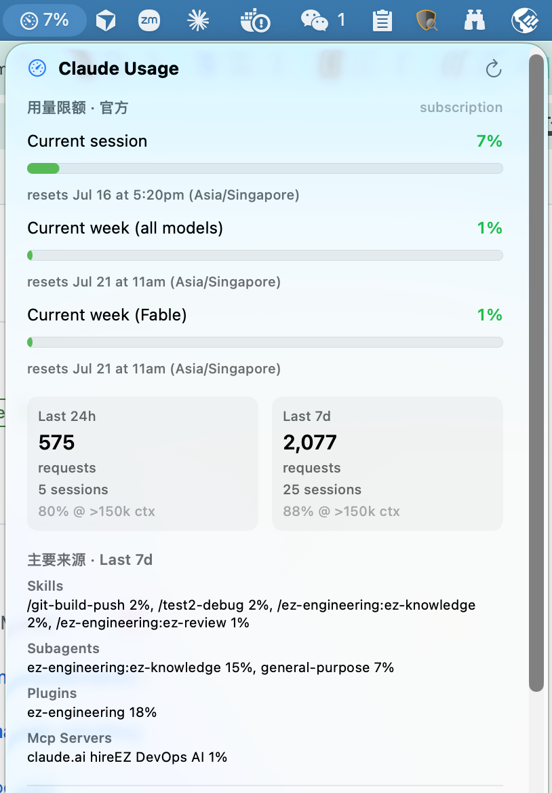
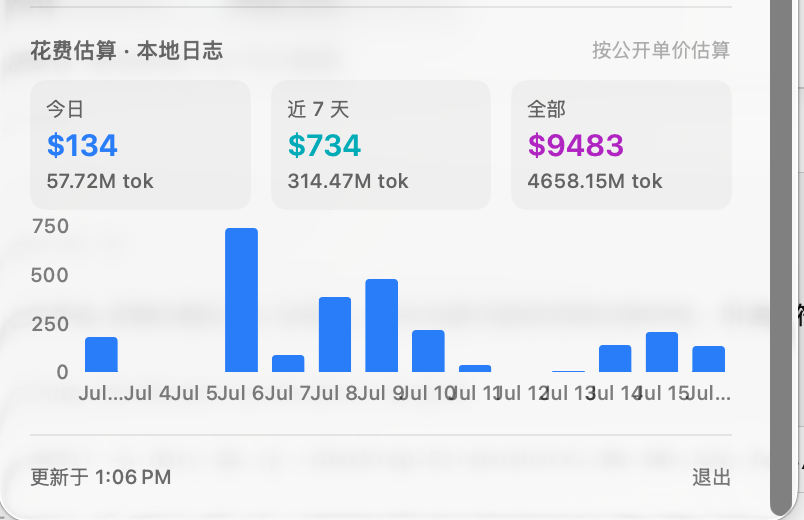

# Claude Usage Monitor

**English** · [简体中文](README.zh-CN.md) · [日本語](README.ja.md) · [한국어](README.ko.md) · [Deutsch](README.de.md) · [Français](README.fr.md) · [Português](README.pt.md) · [Русский](README.ru.md)

A native macOS menu-bar app that monitors **Claude Code**'s official usage limits and estimated spend in real time.

> The app UI auto-adapts to your macOS system language — English, 简体中文, 日本語, 한국어, Deutsch, Français, Português, Русский — and falls back to English otherwise.

## Screenshots

<p align="center">
  
</p>
<p align="center">
  
</p>

## Requirements

- macOS 13+
- **Claude Code** CLI installed and logged in (the app reads official limits via `claude -p '/usage'`)

## Install

1. Download the latest `Claude Usage Monitor.zip` from [Releases](../../releases) and unzip it.
2. Drag `Claude Usage Monitor.app` into Applications.
3. If macOS blocks the first launch: right-click the app → Open; or go to System Settings → Privacy & Security and click "Open Anyway".

> The app is locally ad-hoc signed and not notarized by Apple, so the first launch needs a manual approval.

## Usage

After launching it lives only in the **menu bar** — no Dock icon.

- The menu-bar title shows the current **peak limit usage (%)**; the closer to the limit, the redder.
- **Click the icon** to expand the dashboard:
  - **Usage limits · Official** — usage percentage + reset time for the current session, current week (all models), and current week (Fable). Matches `/usage` inside Claude Code exactly.
  - **Activity windows** — request count, session count, and long-context share for the last 24h / 7d.
  - **Top sources** — the skills / plugins / MCP / subagents that contributed the most over the last 7d.
  - **Estimated cost · Local logs** — today / last 7 days / all-time spend estimated from `~/.claude/projects/**/*.jsonl` at public rates, with a 14-day bar chart.

Refresh cadence: official limits every 5 minutes, local spend every 60 seconds.

### Launch at login

System Settings → General → Login Items → add `Claude Usage Monitor.app`.

## Custom pricing

Spend is estimated at Anthropic's public rates (Fable/Mythos temporarily billed at the Opus tier). To override, create
`~/.config/claude-usage-monitor/pricing.json`, with units in "USD per million tokens":

```json
{
  "fable": { "input": 15, "output": 75, "cacheWrite5m": 18.75, "cacheWrite1h": 30, "cacheRead": 1.5 }
}
```

Keys are matched by model-id substring (e.g. `opus`, `sonnet`, `haiku`, `fable`). Non-Anthropic models with no rate are counted as $0 in cost, but their tokens are still tallied.

## Build from source

```bash
./build.sh
open "dist/Claude Usage Monitor.app"
```

Requires Swift 6 (Xcode command-line tools). Output lands in `dist/` (not tracked in version control).
